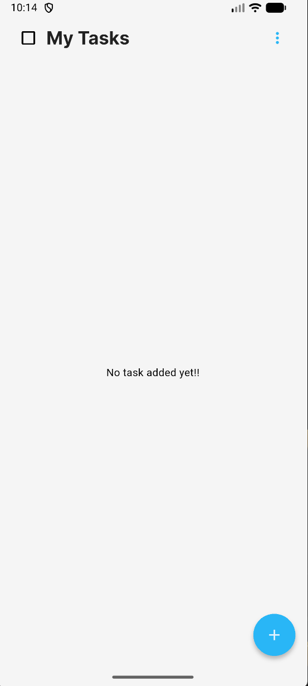
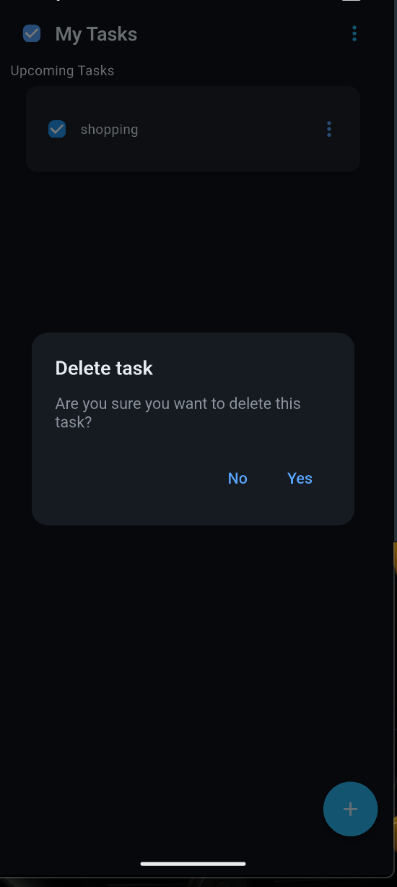
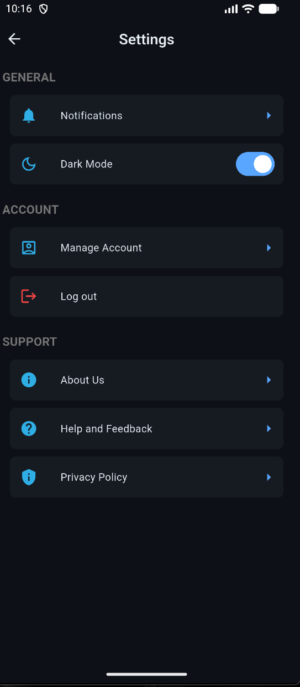

📱 Task Management App
A sleek and responsive Flutter application designed to help users manage their daily tasks with clarity and ease.

✨ Features
- ✅ Add, edit, delete, and cancel tasks
- 📋 Scrollable task list with clean UI
- 🎨 Beautiful layout using Flutter widgets
- 💾 (Coming soon) Persistent local storage for tasks

🖼️ Screenshots

🚀 Getting Started
To run this project locally:
flutter pub get
flutter run

Make sure you have Flutter installed. If not, follow the Flutter installation guide.

📚 Resources
If you're new to Flutter, check out:
- Write your first Flutter app
- Flutter Cookbook
- Flutter Documentation

👨‍💻 Developer
Crafted with ❤️ by Ashish
Flutter Developer & UI Designer
Kathmandu, Nepal
